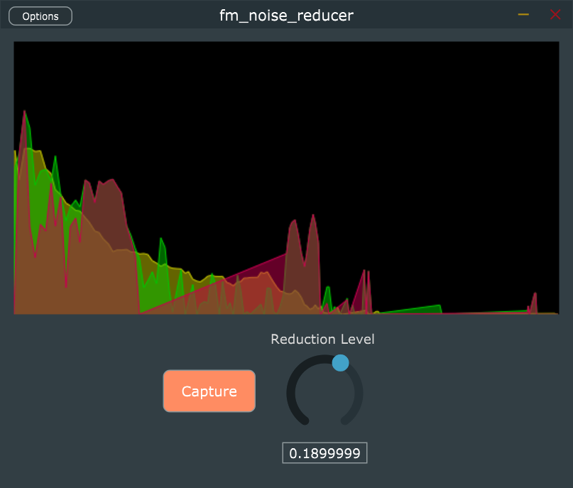

## fumi2kick vst3 plugin - "Noise Reducer"

無音時のホワイトノイズ状態をキャプチャして以降の音声から減算する形の
ノイズ除去プラグインを自作してみるプロジェクトです。

VST3 ホストで利用するか、スタンドアロンアプリを起動して使用します。

当プラグイン単体での音声遅延時間は多分 22ms 位です。

JUCE ライブラリを使用しています。

# ライセンス

License is GPLv3

当プラグインのライセンスは GPLv3 です。
JUCE ライブラリにて GPLv3 の使用を選択して利用しています。

# ビルド方法

## 用意するもの

- JUCE ライブラリと projucer
- Visual Studio community 2019 (もしくはそれ以上)

## 手順

1. juce.com から projucer を含んだ JUCE ライブラリを入手します
2. projucer を起動してライブラリパス等の初期設定を行います
3. 当リポジトリをクローンします
4. 当リポジトリ内の `fm_uchinoko_voice.jucer` を projucer にて open します
5. projucer の export で Visual Studio 2019 を選択して "Save Project and Open IDE" を実行して build project を生成します
6. Visual Studio が起動するので、ソリューションをビルドします

# 使い方

- Capture
  - ノイズ状態をキャプチャーします(およそ 2秒程度)
  - 無音状態を維持した状態でクリックしてください
  - 黄色いグラフが表示されたらそれが学習したノイズの強度です
- Reduction Level
  - ノイズ除去の強さを変化させます
  - 黄色いノイズ領域が上下します、基本的にこの黄色い線より弱い周波数帯はノイズとして除かれます

## vst3 プラグイン

vst3 プラグインの配置場所にコピーしてください。

64bit Windows では `c:\Program Files\Common Files\VST3\` へコピーします。

## スタンドアロンアプリ

`fm_noise_reducer.exe` を起動します。

Option でオーディオデバイスとマイクデバイスを設定してください。

# 仕組み

入力音声を FFT で周波数成分に分解し、周波数成分を編集した後 iFFT で音声信号に戻しています。

FFT 変換した音声を色々加工して楽しむための実験コードとなります。

# credit

## author

- rerofumi (@rerofumi, @hesui_channel)

## update

- Mar.13.2021 / Ver0.1.0
  - First Release
